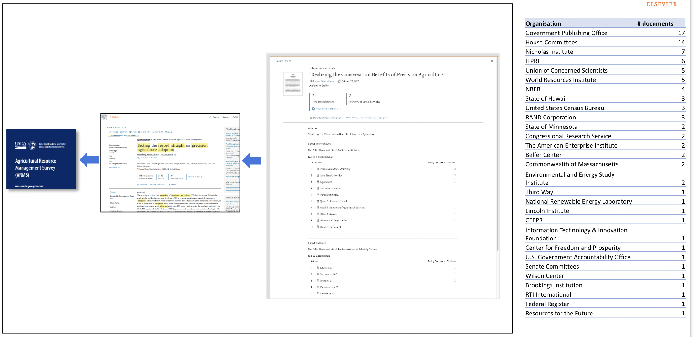

# Chapter 2: Background and Context

### 2.1   Vision and Goals

The vision of the Democratizing Data project is to improve the practice of both government policy and research, by providing evidence about how datasets are used and building an ecosystem of agencies, researchers, and other stakeholders that are committed to revealing the value of data and evidence.

The Search and Discovery Platform advances that vision by providing a platform with multiple access modalities - a user dashboard, Jupyter notebooks, and an API -whereby agencies can get a better understanding of how their data are used.

### 2.2   Agency Questions

Agencies have identified a set of questions: each modality is structured to provide agency staff and researchers a different lens into the questions. It is likely that agencies will develop other questions as the program develops more understanding about how datasets are used, and their impact on evidence and policy, so this list should be seen as a starting not an ending point.

#### 1.   Basic Usage Information

How much are agency datasets used in research and how has that usage changed over time? How often is each one of an agency’s identified dataset used in research and how has that usage changed over time?

#### **2.   Details about the agency’s portfolio**

What topics are an agency’s datasets being used to study and what publications are associated with each topic?

What topics are each one of the agency’s identified datasets used to study in research and what publications are associated with each topic? What other datasets are being used to study each topic?

#### 3.   Drilling into the details for each dataset

Who are the main authors using each agency’s datasets? Who are the main authors using each specific dataset? What are the publications associated with each author? What institutions are the centers of use for each agency dataset and in what geographic locations are the institutions located?

### 2.3   Response to Legislative Mandate and Committee Recommendations

The platform directly supports Section 202(c) of the Evidence Act Title 2 (OPEN Government Data Act), namely to

* Facilitate collaboration with non-Government entities (including businesses), researchers, and the public for the purpose of understanding how data users value and use government data
* Engage the public in using public data assets of the agency and encourage collaboration by publishing on the website of the agency, on a regular basis (not less than annually), information on the usage of such assets by non-Government users, and
* Assist the public in expanding the use of public data assets

It also directly supports several of the recommendations to OMB of the Advisory Committee on Data for Evidence Building (see also Figure 1)

<figure><figcaption>
Figure 1: Recommendation of ACDEB
</figcaption></figure>

* Measure the utility of data (Recommendation 1.6)
* Optimize user experience for the Standard Application Process (Recommendation 1.10)
* Promote Accessibility and Auditability through data search and discovery Recommendations (5.1 – 5.4)

The platform can also support the Standard Application Process by providing information to researchers about the use of federal data assets in the Federal Statistical Research Data Center system.

### 2.4   History

The project began in 2016 when NYU was asked by the US Census Bureau to build a secure environment to host confidential microdata to inform the decision making of the Commission on Evidence-Based Policymaking. It quickly became apparent that simply hosting data was insufficient; a search and discovery functionality was needed to find out

1. **how** data are used, so that government agencies can better understand the utilization of their data investment portfolio and scientists can find other ways in which data have been used
2. by **whom**, so that government agencies and their stakeholders as well as scientists (particularly junior faculty and graduate students) can find experts, and
3. to study what **topics** so that government agencies can identify how well their data investments are supporting their mission and scientists can find other work that is complementary to their own.

The challenge was that the information about data use is not readily found - A joint project between the developers of Jupyter - Brian Granger and Fernando Perez - and Julia Lane of NYU was funded by the Alfred P. Sloan Foundation and Schmidt Futures to see if it was possible to use Machine Learning and Natural Language Processing tools to automate the discovery of dataset mentions in scientific documents. The team developed and hosted the first rich context competition in 2018; the results were reported in a Sage [book](https://study.sagepub.com/richcontext) published in 2019.

A national conference was subsequently hosted at the National Press Club in November 2019 – also funded by Schmidt Futures and the Alfred P. Sloan Foundation - which was designed to produce a roadmap to identify the opportunities, gaps, and necessary investments, develop an interdisciplinary community of computer scientists, life scientists, and social scientists who can work together to address the problems and engage key stakeholders, notably funding agencies, and government agencies.

The output from the workshop fed into continuing work and during 2021, the effort resulted in a Kaggle competition, known as Show US the Data to develop open algorithms that would improve on the previous efforts. Over 1600 data science teams worldwide competed. The winning algorithms were unveiled at a conference in October 2021 hosted by the Coleridge Initiative and the open access consortium CHORUS and they are the ones currently used in the platform.

A pilot was then initiated with one of the CHORUS board members, Elsevier, to test the possibility of connecting agency datasets with a fully curated corpus of publications, Scopus (Figure 2), and policy documents (Figure 3).

<figure><figcaption>
Figure 2: The links between agency datasets and publications
</figcaption></figure>

<figure><figcaption>
Figure 3: The potential next links to policy impact
</figcaption></figure>

### 2.5   Academic and Research Partners

The project is the result of a collaboration among six academic partners. The role of each is described below.

**NYU:** New York University (NYU) is responsible for overall coordination and management of the effort to develop and implement the platform. The NYU team is the primary agency contact.

**Elsevier:** Elsevier provides the information infrastructure - the curated corpus of documents such as publications and patents - that provides the basis on which to run the algorithm, optimizes the search space, applies the existing algorithms to search and discover specific datasets, and produces metadata to feed into the validation process and the API, dashboards, and Jupyter Notebooks.

**The Institute for Data Intensive Engineering and Science (IDIES) at Johns Hopkins University (JHU):** IDIES ingests and processes the metadata output from the ML algorithm into a database that can be validated in the validation tool. then feeds the validated output to the API. IDIES developed the validation tool so that the agencies or their designated collaborators can validate the output. IDIES also developed [SciServer](https://sciserver.org/), a collaborative, web-based science platform.

**Texas Advanced Computing Center (TACC):** Designed, developed, and is implementing the API to disseminate the validated metadata received from JHU. TACC also has enabled the frontend tool implementation by enabling the web connector for Tableau software for visualization in a dashboard. TACC will be developing a browser-based dashboard.

**University of Texas at San Antonio (UTSA)** is validating the ML output for some agencies. They will also work to support ML model development and the researcher engagement at conferences. Their team will play an important role in analyzing and promoting the progress and success of the project.

**University of Maryland, College Park (UMD)** is developing a website that describes the methodology, approach, and relevant materials for the user community. They will jointly host one or more workshops for researchers to react to the findings and measurement.

### 2.6   Current Agency Partners

**National Center for Science and Engineering Statistics (NCSES):** NCSES supported the work from the earliest stages. Their goal was to show how NCSES data were being used and tie the information into their revamped website. Later, the development of usage statistics is likely to be important as they establish the National Secure Data Service.

**US Department of Agriculture:** Economic Research Service (ERS) also supported the work from the earliest stages. It set the initial direction of tool development and implementation. The National Agricultural Statistical Service (NASS) worked with ERS to identify the initial USDA data sets and possible visualization tools, identified validators (either internal or external). They also will conduct research to develop a theory of change and will develop targeted messages to survey respondents to increase overall response rates.

**Department of Education:** National Center for Education Statics (NCES) has a number of goals:

* **Relevancy** Determine who is using NCES data, including networks of dominant users
* **Priority** Understand which data sets are being used the most and which the least
* **Equity** Gain an equity perspective on use of NCES data
* **Community** Build partnerships with researchers who are conducting research in areas of interest to NCES

**Department of Commerce:** The National Oceanic and Atmospheric Administration (NOAA)’s primary objective was to develop a reusable data discovery interface. The overall goal for NOAA is to use machine learning to find citations to NOAA datasets in journal articles and other scientific literature. This knowledge will help highlight the value of NOAA’s open data, track the provenance of data used in scientific research, and help new users find trusted data that is relevant to their research topic.

**National Institutes of Health:** The primary objective is to provide a rich and innovative set of tools for addressing data sharing problems by enabling search and discovery for the subsequent use of NIH funded digital data assets. The NIH project is sponsored by the Office of Data Science Strategy. It will identify a subset of HIV datasets found in Mendeley Data\* and find the publications that cite those datasets. It will expand information the use of data in the Mendeley data repository, such as number of views and downloads to include other aggregate measures generated from the Democratizing Data platform such as diversity of use, use within specific disease ecosystems and ecosystem services, use within particular communities, and use of particular [historical significance .](https://data.mendeley.com/) The team will also develop dataset use at the researcher level, to identify and encourage experts who share their expertise, as well as at the institutional level to help inform program investment decisions. The platform will enable NIH/ODSS to extend to and engage with their associated communities, following on from the January 2022 [ODSS dataset search workshop](https://datascience.nih.gov/data-infrastructure/search-workshop).&#x20;

