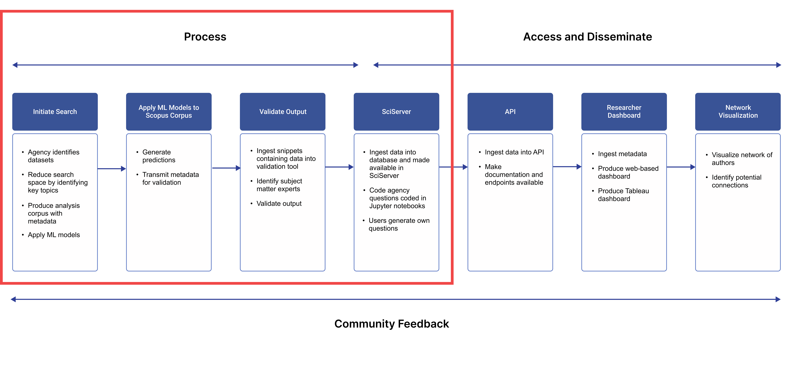
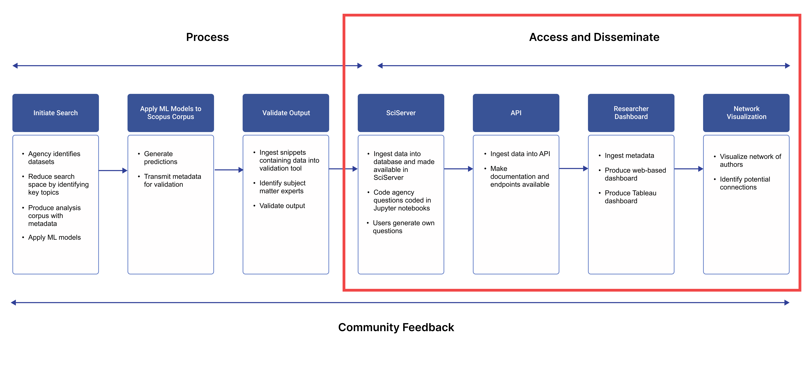

# Chapter 3: Workflow Overview

There are three main workflow stages: identifying and finding datasets in publications (process); providing agency and researcher access to information through APIs, Jupyter Notebooks and usage dashboard (access and disseminate), and getting feedback from the user community (feedback).

### 3.1   Process

<figure><figcaption>
Figure 4: Process
</figcaption></figure>

**Initial Search:** An agency identifies a list of datasets of interest (target datasets), ideally including commonly used dataset aliases and, where available, the dataset digital object identifier (DOIs). Elsevier works with NYU to identify a search corpus of full text publications on which the ML models can be run. For more details see [Chapter 5](05-algorithms.md).

**Apply ML models:** Elsevier runs the three ML models to identify candidate datasets mentioned in publications within the search corpus, producing as output:1. the dataset-publication pairs (dyads) 2. snippets of text containing the mention to assist in validation and 3. associated metadata on ML performance and other relevant runtime parameters. Machine Learning algorithms are applied to the licensed full text records in the search corpus to identify those research outputs which contain candidate datasets. The ML algorithms are then further supplemented with matching routines that search for closely related strings (fuzzy matches). The final step in the Elsevier workflow is to generate the metadata for the research outputs identified as containing the datasets. For more details, see [Chapter 6.](06-validationtools.md)

**Validate:** The output of those models predicts whether a dataset is mentioned, and Elsevier provides the metadata (journals, authors, institutions, geographic locations and research topics inter alia) associated with those publications to IDIES at JHU for validation.

IDIES retrieves the output information from Elsevier via a predefined secure transport mechanism (in this case delivery of data to an AWS S3 bucket). It then performs a set of automated validations of the format and consistency prior to loading from the file-based format to a relational database. In this process files are cached within the SciServer (described below) environment for further inspection as necessary.&#x20;

The metadata are ingested into a database (schema is available in [Appendix A](appendix-a.md); the metadata table and data dictionary in [Appendix B](appendix-b.md)) and made available to designated agency staff to validate the output in a validation tool. They validate the data by inspecting snippets and validating the ML identification via a web-based tool. This is a first pass in the quality control of the output metadata. There is the potential of adding additional features if resources are available. In particular, researchers could provide additional validation of the results of the ML algorithm by providing feedback on publications that may have been missed or mischaracterized, since the validation process creates rich opportunities for participation and engagement. For more details, see [Chapter 7](07-jupyterandsciserver.md).

Once complete, the full result, including validation is sent to TACC to be ingested in the official API for consumption by end-users.&#x20;

An administrative dashboard is also being built; that documentation will be made available in Version 2 of this user guide.&#x20;

The full technical description of this workflow is available in [Appendix C](appendix-c.md).

### 3.2   Access and Dissemination

<figure><figcaption>
Figure 5: Access and Disseminattion
</figcaption></figure>

There are three access modalities: Jupyter Notebooks, an Application Programming Interface (API), and an interactive usage dashboard. Each is designed to provide different insights into answering the core [Agency Questions](02-background.md#2.2-agency-questions) that are the reason for building the Search and Discovery Platform.

**Jupyter Notebooks**: The Jupyter Notebooks can be accessed through SciServer [https://www. sciserver.org](https://sciserver.org/), which is a science platform built and supported by the Institute for Data Intensive Engineering and Science (IDIES). Sciserver builds upon and extends the SkyServer system of server-side tools that introduced the astronomical community to SQL (Structured Query Language) and has been providing the Sloan Digital Sky Survey catalog data to the public.&#x20;

The Jupyter Notebooks are structured to enable researchers to access a database that contains the metadata. Researchers can either program their own queries or access a preprogrammed set of 20 questions about use of the data. SciServer allows researchers to collaborate using hosted data sets in a secure environment, among many other features. For more details, see [Chapter 8.](08-api.md)

**Application Programming Interface (API)**: The API allows users to download the metadata in order to create their own dashboards or methods of analysis. The endpoints reflect the key information requested by the agencies - publications, citations, authors, institutions, locations, and journals. The API has a web data connector that allows the metadata to be downloaded into Tableau software to create visualizations. For more details, see [Chapter 9.](09-usagedashboard.md)

**Dashboard:** The dashboard and other visualizations illustrate:(1) how data are being used for research; (2) the primary topics of the research; (3) the researchers who have published; (4) how often that research has been cited; and (5) institutions affiliated with the researchers. The dashboards can be structured to inform the agency that is producing the data or also to be a community dashboard that is accessed by the research community and greater public. The dashboard is a type of researcher “leaderboard”, identifying the top researchers for different datasets based on the number of their publications and citations. This enables an understanding of who is using the data and their topics of study and helps build collaborative communities. The ancillary benefit to the researchers is a place where their publications can be widely seen and cited in future research, thus encouraging other agencies and collaborators to join in.

In addition, the project team created a sample of five-minute podcasts with top researchers to discover more about their research and how it benefits the public. The researchers were able to provide advice to other researchers using or considering using the data sets, as well as suggestions for how agencies could improve their data and make it more useful. The sample podcasts were published in the Harvard Data Science Review and are available [here](https://hdsr.mitpress.mit.edu/pub/gnf4pmig/release/3). As participation increases, these podcasts can be embedded in the API or dashboard, providing practical advice to researchers considering using the identified data sets. For more details, see [Chapter 9](09-usagedashboard.md).
