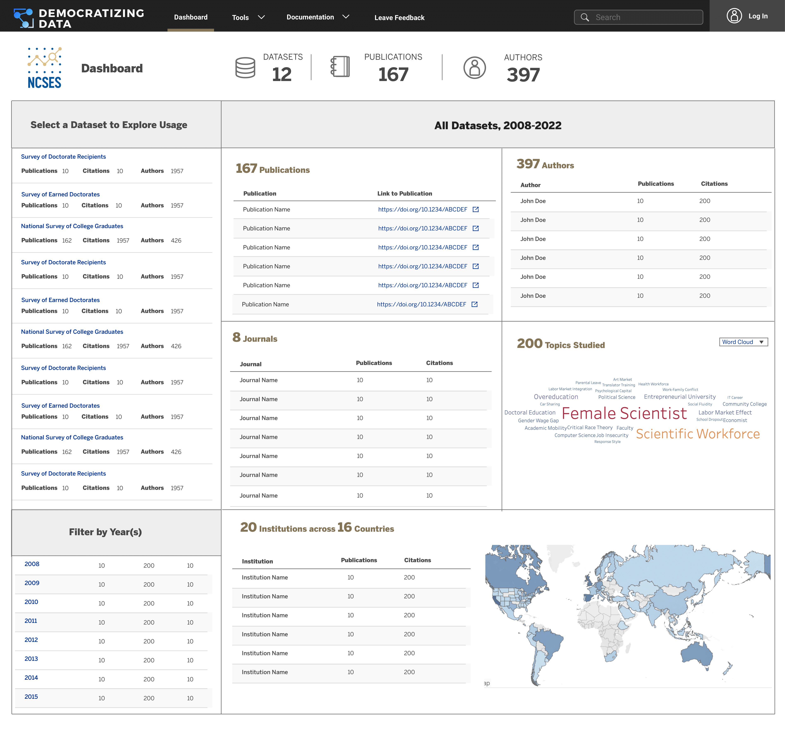

# Chapter 9: Usage Dashboard

Beyond offering an API, the platform currently provides a prototype usage dashboard that enable agencies to visualize answers to [agency questions](02-background.md#2.2-agency-questions). The initial example for USDA can be viewed [here](https://public.tableau.com/app/profile/democratizing.data.hl/viz/DemocratizingData-WebDataConnector-USDA-NewLayout/Publications).

As the project evolves, and agencies share resources, it is expected that new dashboards will evolve, as USDA/NASS has shown with their approach [here](https://public.tableau.com/app/profile/national.agricultural.statistics.service/viz/5WsofNASSDataUsage/The5Ws). The proposed production version for a common agency baseline website is in wireframe stage and described in the following sections.

### 9.1 Basic Usage Information

The initial agency landing page will provide basic usage information, as required by the Foundations of Evidence-based Policymaking Act. Agencies have asked that the landing page provide information about how much agency datasets are used in research and how has that usage changed over time.

### 9.2 Portfolio Information

Agencies have also asked for reports about their portfolio: i.e., how their data are used. Their questions include: What topics are agency datasets being used to study, and what publications are associated with each topic? What topics are each one of an agency’s identified dataset used in research and what publications are associated with each topic? What other datasets are being used to study each topic? Figure 12 shows the answers to those questions.

<figure><figcaption>
Figure 12: Portfolio information
</figcaption></figure>

### 9.3 Drilling into details

Agencies have also requested information that can also be used by researchers about each dataset in their portfolio, as shown in Figure 13. They have specific questions and the goal of these dashboards is to provide an easy-to-use and clear-to-understand interface to answer the most pressing questions. Their questions include: who are the main authors using each agency’s datasets? Who are the main authors using each dataset, and the associated publications? What institutions are the centers of use for each agency dataset and in what geographic locations are the institutions located? What are the journals publishing work using the dataset?

<figure><figcaption>
Figure 13: Researcher dashboard with dataset specific information
</figcaption></figure>
