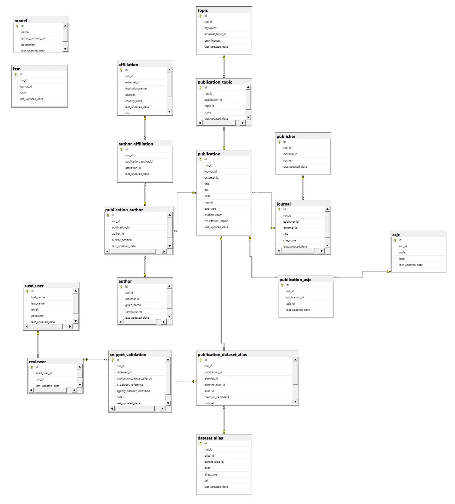

# APPENDIX A: Metadata Schema

This describes the metadata schema. The Data Dictionary is provided in [Appendix B](appendix-b-metadata-table-and-data-dictionary.md).

<figure><figcaption>
Figure 14: Metadata schema
</figcaption></figure>

